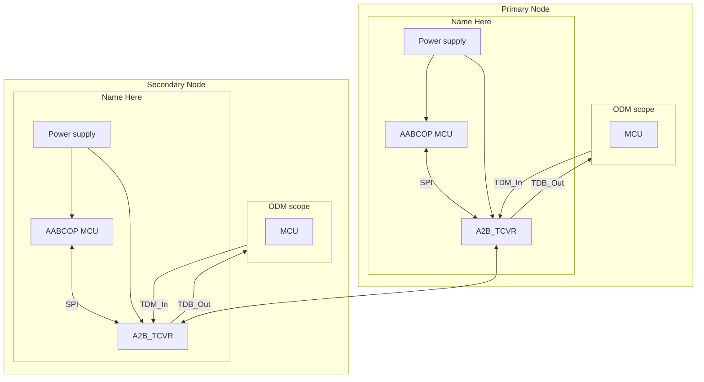
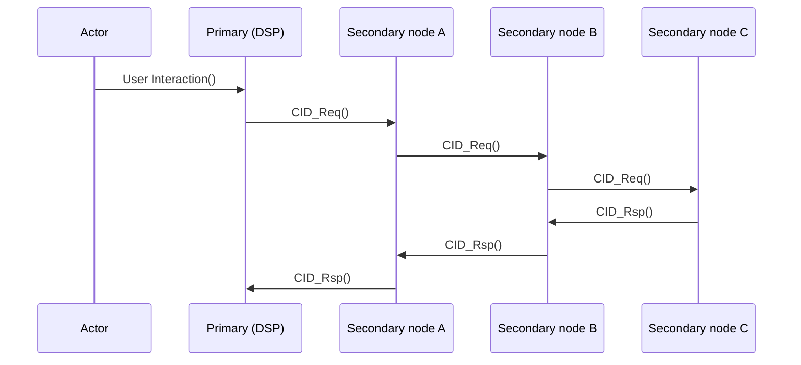
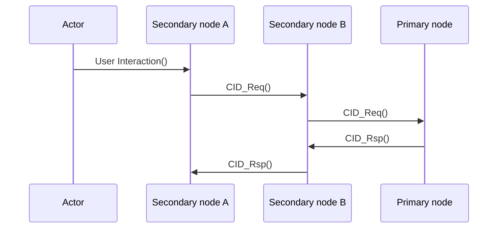
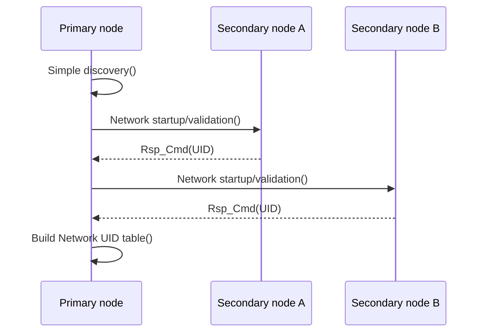
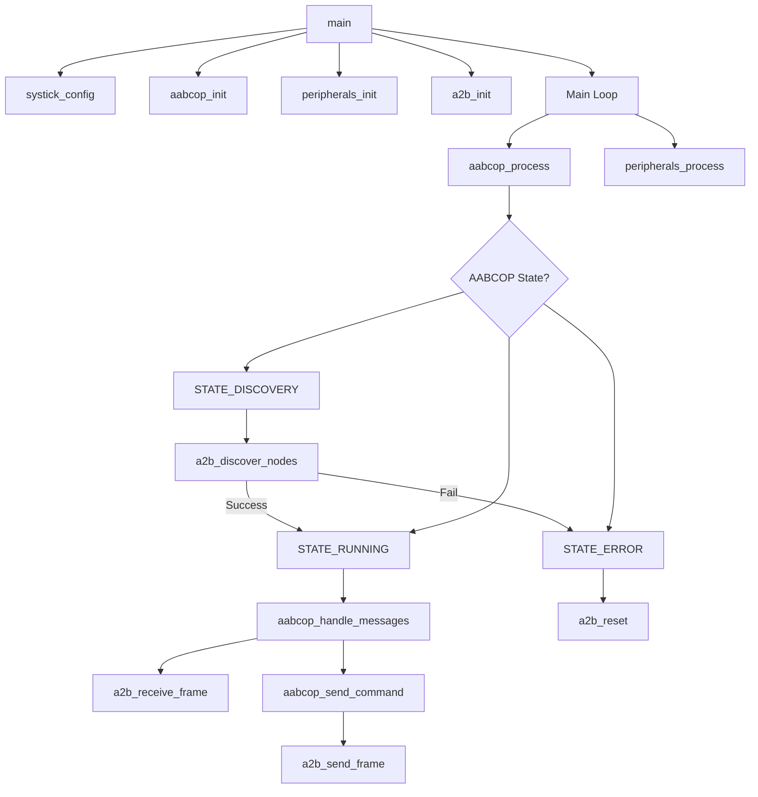
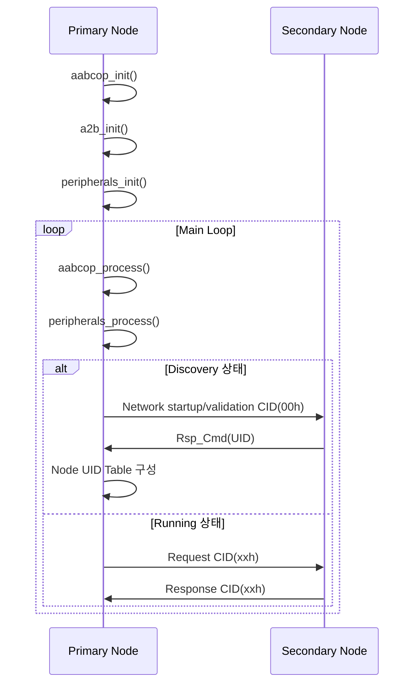

AAB Communication Protocol (AABCOP)

over A2B

| Version | 1.0 |
| --- | --- |
| Date | Feb/21/2025 |
| Status | Released |
| Document ID | 800\_AABCOP\_Specification |
| Owner | Monserrat Romero |

**Revision history**

| **Date** | **Version** | **Author** | **Summary** |
| --- | --- | --- | --- |
| Jul/15/2024 | 0.1 | Monserrat Romero | First version |
| Sep/11/2024 | 0.2 | Luis Herrería | Updated based on discussions with ADI. |
| Sep/13/2024 | 0.3 | Luis Herrería | Updated CIDs section |
| Dec/19/2024 | 0.4 | Herrería/Romero/Seijas | Read Mailbox, Single and Multi-frame updates |
| Feb/07/2025 | 0.5 | Herrería/Romero/Seijas | A2B network configuration, CID, devices, SPI interface updates |
| Feb/10/2025 | 0.6 | Monserrat Romero | Devices updates, SPI interface for Inter MCU communication |
| Feb/21/2025 | 1.0 | Herrería/Romero/Seijas | Overview, Start up sequence, TP Errors, Application errors, CIDs |

# Reference documents

| Document | Revision |
| --- | --- |
| AD243x Automotive Audio Bus A2B Transceiver Technical Reference | Revision 0.1, March 2019 |
| EES JBL DANG | Rev. 1.6, December 2024 |
| EES JBL DSP2.0 | Rev. 1.2, February 2025 |
| EES JBL Nodes | Rev. 1.0, January 2025 |

Contents

[Reference documents](#Reference-documents)

[1. Scope](#1-Scope)

[2. Intellectual Property Rights](#2-Intellectual-Property-Rights)

[3. Abbreviations and Definitions](#3-Abbreviations-and-Definitions)

[4. Protocol Overview](#4-Protocol-Overview)

[4.1. Transmission process](#41-Transmission-process)

[4.2. Audio configuration](#42-Audio-configuration)

[4.2.1. Audio configuration for long network](#421-Audio-configuration-for-long-network)

[4.2.2. Audio configuration for high channel count](#422-Audio-configuration-for-high-channel-count)

[4.3. A2B power related functionalities](#43-A2B-power-related-functionalities)

[5. Physical layer](#5-Physical-layer)

[5.1. A2B Network](#51-A2B-Network)

[5.2. Simple discovery](#52-Simple-discovery)

[5.3. SPI interface](#53-SPI-interface)

[5.4. A2B Node Address](#54-A2B-Node-Address)

[5.5. Read mailbox](#55-Read-mailbox)

[6. Trasport layer](#6-Trasport-layer)

[6.1. Errors in TP layer](#61-Errors-in-TP-layer)

[6.1.1 Error at sender](#611-Error-at-sender)

[6.1.2 Error at receiver](#612-Error-at-receiver)

[7. Application layer](#7-Application-layer)

[7.1. Unit identifier](#71-Unit-identifier)

[7.2. Application Start](#72-Application-Start)

[7.3. Application diagnostics and error handling](#73-Application-diagnostics-and-error-handling)

[8. CID description](#8-CID-description)

[8.1. Network generic CIDs](#81-Network-generic-CIDs)

[8.2. Audio control CIDs](#82-Audio-control-CIDs)

[8.3. Audio inputs CIDs](#83-Audio-inputs-CIDs)

[8.4. Equalization CIDs](#84-Equalization-CIDs)

[8.5. Audio configuration and PLL Lock CIDs](#85-Audio-configuration-and-PLL-Lock-CIDs)

[8.6. Sensor CIDs](#86-Sensor-CIDs)

[8.7. Module configuration CIDs](#87-Module-configuration-CIDs)

[8.8. Protection and diagnostics CIDs](#88-Protection-and-diagnostics-CIDs)

[9. Module functions capability](#9-Module-functions-capability)  

[10. C Code Project Explanation](#10-C-Code-Project-Explanation)

----------------------------------------------  

### T Introduction  

This document defines AABCOP (High‑level A2B Communication Protocol), a logical layer that runs on top of Analog Devices’ A2B physical/transport stack.
Conventional A2B systems require the primary node to hold a pre‑programmed description of every secondary node. This tight coupling reduces serviceability and complicates aftermarket expansions.
AABCOP addresses this limitation by enabling dynamic node discovery and capability negotiation without prior knowledge of the network composition.
The target hardware platform consists of AD2433 transceivers interfaced to GD32E502 MCUs.
Each secondary amplifier node now incorporates an MCU, two DACs, one ADC, a temperature sensor, and dual boost converters over I²C, allowing in‑situ diagnostics and closed‑loop control.
This specification focuses on the communication protocol; audio signal‑processing algorithms and hardware schematics are outside its scope.

-----------------------------------------------------------  
# 1. Scope

This specification defines the configuration and control commands for communication between the Primary and Secondary A2B nodes connected to a Special or After Markets AAB Audio Network. The main goal is to homologate commands through all different HW devices.

This specification applies to any ECU with an A2B interface from MY25 and beyond.

Any addition, change or ambiguity regarding this specification shall be determined through discussion with AAB QRO Special Markets Engineering group.

# 2. Intellectual Property Rights

This specification is AAB International property. Any use without the consent of the AAB International Engineering team shall be disclosed for legal action to be taken.

Any development or invention created using this document will belong to AAB International. Any discussion about intellectual property rights shall be notified to AAB legal department.

To be able to disclose this document an NDA should be put in place before information exchange.

# 3. Abbreviations and Definitions

The following is a list of abbreviations to guide the user through a comprehensive reading of the document.

| Abbreviation | Description / Definition |
| --- | --- |
| ADI | Analog Devices |
| AB | Audio Bridges |
| AMP | Amplifier |
| dB | Decibel |
| DSP | Digital Signal Processing |
| ECU | Electronic Control Unit |
| HW | Hardware |
| Hz | Hertz |
| CID | Command Identifier |
| OVP | Over voltage protection |
| UVP | Under voltage protection |
| OCP | Over current protection |
| TFB | Thermal fold back |
| TSD | Thermal shut down |
| MCU | Micro Controller Unit |
| SVC | Speed-sensitive Volume Compensation |
| SW | Software |
| SPI | Serial Peripheral Interface |
| AABCOP | AAB Communication Protocol |
| TP | Transport protocol |
| PA | physical address |
| MY | Model year |  
| AABCOP | Name of the development target protocol |  
| Main node | Main node of A2B Protocol |  
| Sub node | Sub node of A2B Protocol |  
| Primary node | Main node of A2B Protocol |  
| Secondary node | Sub node of A2B Protocol |  
| Master node | Main node of A2B Protocol |  
| Slave node | Sub node of A2B Protocol |  

Table 3. Abbreviation table

# 4. Protocol Overview

All devices (Amplifiers, Digital Signal Processing, Audio Bridges, Head Units, Interface Controls) connected to a AAB Special or After markets network shall comply with the communication protocol described in this document, which includes messaging protocol using A2B / mailbox, while digital audio signal or large data transfer occurs on A2B upstream/downstream data slots. The specification also describes the network configuration and wake up process.

This first revision of the document will consider A2B as an intercommunication protocol; but it is designed to be ported to Bluetooth or Wi-Fi in future revisions.

On each Primary node a dedicated MCU shall command all Command Identifiers (CID) over A2B Mailbox, besides that, input and output TDM audio signals shall be placed depending on device purpose. See diagram below.

<!--  -->  
Figure 4-1 AAB Communication Protocol over A2B  

Markdown Mermaid code of 'Figure 4-1 AAB Communication Protocol over A2B' is following.  

Markdown Mermaid code of 'Figure 4-1 AAB Communication Protocol over A2B'

Both primary and secondary nodes can issue commands, but secondary nodes can only issue commands to a primary node.

An example of the most common case is shown in the following diagram, where a primary node sends Broadcast to all secondary nodes.  

***Primary Node and Secondary Node communicate using A2B.  
There is one Primary Node and multiple Secondary Nodes.  
Starting from the Primary Node, the Secondary Nodes are connected in series.  
Each Secondary Node receives from the Primary Node or the previous Secondary Node and passes it on to the next Secondary Node.***  

<!--    -->
Figure 4-2 Primary node broadcast example  

Markdown Mermaid code of 'Figure 4-2 Primary node broadcast example' is following.  

Markdown Mermaid code of 'Figure 4-2 Primary node broadcast example'

Other scenario is when a secondary node issues a command to the primary node as shown in the next diagram. It does not matter if the secondary node that must send the message is not directly connected to the primary node, the message goes through the other secondary nodes.  

***Secondary Node 로 부터 Request 가 출발 가능 하다.***  

<!--    -->
Figure 4-3 Secondary node message to primary example

Markdown Mermaid code of 'Figure 4-3 Secondary node message to primary example' is following.  

Markdown Mermaid code of 'Figure 4-3 Secondary node message to primary example'

## 4.1 Transmission process

The transmission process is described through the different layers.

TODO: Figure 4-4 위치

Figure 4‑4 A2B data transmission

All data communication between the main node and the sub node starts from the application layer and repeats transmission and reception through the process of writing to the mailbox within the Superframe time.

One Superframe is composed of 1024 bits in a maximum time of 20.83μs based on the 48KHz sampling rate, and includes not only the SYNC CONTROL FRAME and A2B DATA SLOTS for transmission, but also the SYNC RESPONSE FRAME and A2B DATA SLOTS for reception.

When transmitting, SYNC CONTROL FRAME configuration (64 bit):

 1)14-bit preamble field to provide clock information to the subordinate node PLL. It is a known pattern and not protected by CRC
 2)18-bit control field. The control field consists of: Bits related to the frame types (normal mode I2C access, broadcast mode access, discovery mode access, and GPIO over distance), 4-bit node field that indicates the targeted node, R/W bit to indicate read/write access, 2-bit header count field (used to keep track of header count synchronization) 
 3)8-bit register address field is the target register address value of the I2C address 
 4)8-bit data field for a write operation 
 5)16-bit CRC field to protect the SCF field (except the preamble field)

When receiving, SYNC RESPONSE FRAME configuration (64 bit):

 1)14-bit preamble field to mark the start of the upstream part of the superframe. This field is used by upstream nodes for synchronization purposes and to detect a node drop condition. It is a known pattern and not protected by CRC. Unlike the preamble field in the SCF, the preamble field in the SRF is not used as an input for the node PLL.
 2)10-bit control field. It consists of: access status bits for the acknowledging command received in the previous SCF (ACK, NACK, wait, retry), 4-bit node field to indicate which node generated or modified the SRF, 2-bit header count field (used to keep track of header count synchronization)
 3)8-bit data field that provides a data byte for read operations
 4)6-bit reserved field
 5)16-bit CRC field that protects the 10-bit control, 8-bit data and 6-bit reserved fields. It does not protect the 14-bit preamble and 6-bit IRQ fields.
 6)6-bit IRQ. The subordinate node communicates to the main node that it has detected an interrupt. The field is comprised of: 1-bit IRQ bit to indicate that an active interrupt is available, 4-bit NODE ID to indicate the subordinate node ID that generated the interrupt
 7)4-bit CRC. There is a separate CRC protection for the 6-bit IRQ field.

NOTE: The separate IRQ field along with CRC protection allows the upstream node to convey interrupt information without modifying the previous bits of the SRF. So, one node can respond to the I2C command
through the initial part of the SRF and another node can add interrupt information in a later part of the
SRF

The application layer is expected to be composed of at least one UID (1 byte), one CID (1 byte), and Data (1 byte), which are variable and of pointer type. The total number of data for UID, CID, and Data sent from the application layer is L_SIZE, and L_SIZE can be expressed as sizeof(Data) / sizeof(Data[0]), and the structure of the frame is composed slightly differently depending on the L_SIZE value. If L_SIZE is 2 or less, only 1 Single Frame is created. If L_SIZE is 3 or more, 1 Single Frame and L/3 Multi Frames are created. Single Frame sets the structure of FRAME_TYPE variable 1 bit (FRAME_TYPE=0), DATA_SIZE variable 7 bits (total data count L_SIZE), CID 1 byte, DATA0 1 byte, and DATA1 1 byte. Multi Frame sets the structure of FRAME_TYPE variable 1 bit (FRAME_TYPE=1), COUNTER variable 7 bits (COUNTER=1), DATA0 1 byte, DATA1 1 byte, and DATA2 1 byte. The COUNTER variable of Multi Frame is 1 and increases by 1 each time it is created. Multi Frame is declared as an array of up to 32 structures.

When the device boots for the first time, the 7.2 Application Start process (Figure 7-1 IVECOP start up) starts and Simple Discovery() is performed, and up to 16 sub nodes are automatically detected and the address value of each sub node can be known. This value becomes the node field (4 bit) value of the Address Table. After that, if you perform Network startup/validation() of Figure 7-1 IVECOP start up, the main node will send data to each sub node through the physical layer and go through the Build Network UID table() process, which receives Rsp_Cmd (UID) from the sub nodes. The Address Table will be updated to match the received UID value with each node field (4 bit) value of the Address Table and store it. From then on, the UID value of the Application layer is found by matching the node field (4 bit) value of the Address Table with the UID value and stored in the node field (4 bit) of the RESERVED (18-bit control field) of the SYNC CONTROL FRAME (64 bit), and In the Mailbox, each data value is stored in order up to 4 bytes according to Single Frame and Multi Frame as shown below, and A2B DATA SLOTS DOWNSTREAM is created and the Main node transmits it to the Sub node, and the Sub node configures SYNC RESPONSE FRAME and A2B DATA SLOTS UPSTREAM and receives the data transmitted to the Main node again from the Main node.

In case of Single Frame:
0x7F & L_SIZE (bit operation value)
CID
DATA0
DATA1

In case of Multi Frame:
0x80 | COUNTER (bit operation value)
DATA0
DATA1
DATA2
All data should be written to MailBox (maximum 4 bytes) in the order of the values ​​above, and when MailBox is full, MailBox should be initialized and the variable values ​​of all remaining frames should be stored in order in MailBox

## 4.2 Audio configuration

To ensure proper distribution of the audio route all nodes shall comply with two different configurations: 1) maximum number of nodes and 2) maximum resolution possible. These are constrained by the Super frame defined by A2B protocol. It is required that all the configurations are done in Sigma Studio.  

***Sigma Studio is a IDE of Analod Devices.***  

TODO: Figure 4-5 위치  

Figure 4‑5 A2B data transmission

## 4.2.1 Audio configuration for long network

This configuration corresponds to a network with 16 nodes and 32 channels with a 16-bits resolution.

* Master Clock: Fs = 48kHz +/-1%
* Data size shall be 24 bits. (This is due to the channel size plus overhead)
* TDM configuration:
  + TDM mode: TDM16
  + TDM channel size: 16 bits
  + Sync mode: 50% duty cycle
  + Sync polarity: Rising edge
  + DRXn sampling BCLK: Rising edge
  + DTXn change BCLK: Falling edge
  + Tx/Rx offset: 0
* Rx0 and Rx1 shall be configured the same.
* Total number of downstream channels 32.
* Total number of upstream channels 8.

***The following is Table 4-2-1. Table_4-2-1 contains information in table format about the number of channels to be used for each node, the number of slots, TX Activity level, Tranceiver idle time, Bus Activity, and Cable length connected to the A-side of node.***  

<table border="1">
  <thead>
    <tr>
      <th>Node</th>
      <th>Main</th>
      <th>Sub 0</th>
      <th>Sub 1</th>
      <th>Sub 2</th>
      <th>Sub 3</th>
      <th>Sub 4</th>
      <th>Sub 5</th>
      <th>Sub 6</th>
      <th>Sub 7</th>
      <th>Sub 8</th>
      <th>Sub 9</th>
      <th>Sub 10</th>
      <th>Sub 11</th>
      <th>Sub 12</th>
      <th>Sub 13</th>
      <th>Sub 14</th>
      <th>Sub 15</th>
    </tr>
  </thead>
  <tbody>
    <tr>
      <td>Use Slot_Config tab to input upstream/downstream data?</td>
      <td colspan=16>yes or no</td>
    </tr>
    <tr>
      <td>Sub Number (last sub is highlighted yellow)</td>
      <td>0</td><td>0</td><td>1</td><td>2</td><td>3</td><td>4</td><td>5</td><td>6</td>
      <td>7</td><td>8</td><td>9</td><td>10</td><td>11</td><td>12</td><td>13</td><td>14</td><td><mark>15</mark></td>
    </tr>
    <tr>
      <td>Cable length connected to A-side of node [meter]</td>
      <td>N/A</td><td>5</td><td>5</td><td>5</td><td>5</td><td>5</td><td>5</td><td>5</td>
      <td>5</td><td>5</td><td>5</td><td>5</td><td>5</td><td>5</td><td>5</td><td>5</td><td>5</td>
    </tr>
  <tr>
      <td>Enter No. of Downstream Slots transmitted at Port B</td>
      <td>32</td><td>32</td><td>32</td><td>32</td><td>32</td><td>32</td><td>32</td><td>32</td>
      <td>16</td><td>16</td><td>16</td><td>16</td><td>16</td><td>16</td><td>8</td><td>8</td><td>0</td>
    </tr>
    <tr>
      <td>Enter No. of Upstream Slots transmitted at Port A</td>
      <td></td>
      <td>8</td><td>8</td><td>8</td><td>8</td><td>8</td><td>8</td><td>8</td><td>8</td>
      <td>8</td><td>8</td><td>8</td><td>8</td><td>8</td><td>8</td><td>8</td><td>8</td>
    </tr>
    <tr>
      <td>No. of Downstream SPI tunnel slots transmitted at port B</td>
      <td></td><td></td><td></td><td></td><td></td><td></td><td></td><td></td>
      <td></td><td></td><td></td><td></td><td></td><td></td><td></td><td></td>
    </tr>
    <tr>
      <td>No. of Upstream SPI tunnel slots transmitted at port A</td>
      <td></td>
      <td></td><td></td><td></td><td></td><td></td><td></td><td></td><td></td>
      <td></td><td></td><td></td><td></td><td></td><td></td><td></td><td></td>
    </tr>
    <tr>
      <td>Total No. of Downstream Slots transmitted at Port B</td>
      <td>32</td><td>32</td><td>32</td><td>32</td><td>32</td><td>32</td><td>32</td><td>32</td>
      <td>16</td><td>16</td><td>16</td><td>16</td><td>16</td><td>16</td><td>8</td><td>8</td><td>0</td>
    </tr>
    <tr>
      <td>Total No. of Upstream Slots transmitted at Port A</td>
      <td></td>
      <td>8</td><td>8</td><td>8</td><td>8</td><td>8</td><td>8</td><td>8</td><td>8</td>
      <td>8</td><td>8</td><td>8</td><td>8</td><td>8</td><td>8</td><td>8</td><td>8</td>
    </tr>
    <tr>
      <td>B-side Downstream TX activity level</td>
      <td>59.4%</td><td>59.4%</td><td>59.4%</td><td>59.4%</td><td>59.4%</td><td>59.4%</td>
      <td>59.4%</td><td>59.4%</td><td>32.8%</td><td>32.8%</td><td>32.8%</td><td>32.8%</td>
      <td>32.8%</td><td>32.8%</td><td>19.5%</td><td>19.5%</td><td>0.0%</td>
    </tr>
    <tr>
      <td>A-side Upstream TX activity level</td>
      <td></td>
      <td>19.5%</td><td>19.5%</td><td>19.5%</td><td>19.5%</td><td>19.5%</td><td>19.5%</td>
      <td>19.5%</td><td>19.5%</td><td>19.5%</td><td>19.5%</td><td>19.5%</td><td>19.5%</td>
      <td>19.5%</td><td>19.5%</td><td>19.5%</td><td>19.5%</td>
    </tr>
    <tr>
      <td>B-side transceiver idle time</td>
      <td>21.1%</td><td>21.1%</td><td>21.1%</td><td>21.1%</td><td>21.1%</td><td>21.1%</td>
      <td>21.1%</td><td>21.1%</td><td>47.7%</td><td>47.7%</td><td>47.7%</td><td>47.7%</td>
      <td>47.7%</td><td>47.7%</td><td>60.9%</td><td>60.9%</td><td>0.0%</td>
    </tr>
    <tr>
      <td>A-side transceiver idle time</td>
      <td></td>
      <td>21.1%</td><td>21.1%</td><td>21.1%</td><td>21.1%</td><td>21.1%</td><td>21.1%</td>
      <td>21.1%</td><td>21.1%</td><td>47.7%</td><td>47.7%</td><td>47.7%</td><td>47.7%</td>
      <td>47.7%</td><td>47.7%</td><td>60.9%</td><td>60.9%</td>
    </tr>
    <tr>
      <td>Bus activity</td>
      <td>78.9%</td><td>78.9%</td><td>78.9%</td><td>78.9%</td><td>78.9%</td><td>78.9%</td>
      <td>78.9%</td><td>78.9%</td><td>52.3%</td><td>52.3%</td><td>52.3%</td><td>52.3%</td>
      <td>52.3%</td><td>52.3%</td><td>39.1%</td><td>39.1%</td><td>0.0%</td>
    </tr>
      <tr>
      <td>Maximum Bus Activity</td>
      <td colspan="2">893 bits</td>
        <td>87.2%</td>
    </tr>
    <tr>
      <td>Required Bus Idle Time</td>
      <td colspan="2">75 bits</td>
      <td>7.3%</td>
      <td colspan="15">needed for upstream-download switching</td>
    </tr>
    <tr>
      <td>Overall Bus Idle Time at the point of highest activity</td>
      <td colspan="2">131 bits</td>
      <td>12.8%</td>
    </tr>
    <tr>
      <td>Overall Bandwidth Budget used</td>
      <td colspan="2">968 bits</td>
      <td>94.5%</td>
      <td colspan="15">keep < 1024 bits (<100%) For bandwidth usage above 95%, test should be run on silicon to verify</td>
    </tr>
  </tbody>
</table>

***Table 4-2-1***  

Using the information provided by the ADI calculator we can see that the 32 channels cannot reach the end of the network. From nodes 7 and further the channel count is limited.

## 4.2.2 Audio configuration for high channel count

This configuration corresponds to a network with 12 nodes and 16 channels of 24-bits resolution.

* Master Clock: Fs = 48kHz +/-1%
* Data size shall be 32 bits. (This is due to the channel size plus overhead)
* TDM configuration:
  + TDM mode: TDM8
  + TDM channel size: 24 bits
  + Sync mode: 50% duty cycle
  + Sync polarity: Rising edge
  + DRXn sampling BCLK: Rising edge
  + DTXn change BCLK: Falling edge
  + Tx/Rx offset: 0
* Rx0 and Rx1 shall be configured the same.
* Total number of downstream channels 16.
* Total number of upstream channels 8.

TODO: 이미지 삽입  
Using the information provided by the ADI calculator we can see that the 16 channels can reach the end of the network.

## 4.3 A2B power related functionalities

The A2B protocol supports power related functionalities. These are phantom power and wake-up capabilities.

The AABCOP system does not support phantom power since the uncertainty of the topology makes it hard to estimate the supplies for a node or makes it more expensive to develop.

All nodes should contain the capability to wake-up through A2B. Refer to the latest release of the A2B spec to develop this circuit.

# 5. Physical layer

This chapter describes how nodes shall be conformed at HW level and how AABCOP interacts with the existing A2B protocol developed by Analog Devices.

There are 2 node types:

1) **Primary node**. Responsible for Network configuration and A2B communication protocol, reasons why there shall be only one Primary node in the Network.

2) **Sub node**. Responsible for receiving, interpreting, processing and replaying to the primary node following this specification.

A microcontroller on the Sub-nodes is mandatory to comply with the specification and be able to provide diagnostics following the CID format from this specification.

The A2B ecosystem consists of diverse nodes. The following table summarizes the current programs and the devices that shall be used, for reusability and cost reasons. Each node has its own Electrical Specification for more details.

<table border="1">
    <tr>
        <th rowspan="2"></th>
        <th rowspan="2">DANG AMP</th>
        <th rowspan="2">DSP 2.0</th>
        <th rowspan="2">Ascent One Commander</th>
        <th colspan="3">Accessory Nodes</th>
    </tr>
    <tr>
        <th>A2B-HDMI</th>
        <th>A2B-BLE/Wi-Fi</th>
        <th>A2B-RCA</th>
    </tr>
    <tr>
        <td>Node type</td>
        <td>Secondary</td>
        <td>Primary/Secondary</td>
        <td>Secondary</td>
        <td>Secondary</td>
        <td>Secondary</td>
        <td>Secondary</td>
    </tr>
    <tr>
        <td>A2B TCVR</td>
        <td>AD2433</td>
        <td>AD2433</td>
        <td>AD2433</td>
        <td>AD2433</td>
        <td>AD2433</td>
        <td>AD2433</td>
    </tr>
    <tr>
        <td>Primary MCU</td>
        <td>GD32E502KBU7</td>
        <td>GD32E518VET6</td>
        <td>STM32G070CBT6</td>
        <td>GD32E518RET6</td>
        <td>GD32VW553HIQ7</td>
        <td>GD32E518RET6</td>
    </tr>
    <tr>
        <td>Secondary MCU</td>
        <td>NA</td>
        <td>GD32E518RET6</td>
        <td>NA</td>
        <td>NA</td>
        <td>NA</td>
        <td>NA</td>
    </tr>
    <tr>
        <td>DSP</td>
        <td>NA</td>
        <td>ADSP-21569</td>
        <td>NA</td>
        <td>NA</td>
        <td>NA</td>
        <td>NA</td>
    </tr>
    <tr>
        <td>SoC</td>
        <td>NA</td>
        <td>NA</td>
        <td>MT8518S</td>
        <td></td>
        <td></td>
        <td></td>
    </tr>
</table>

Figure 5-1 Device selection

## 5.1 A2B Network

The following table shows an example of the connections needed of the ports on each node. Moving downstream from the main node all port connections need to go from a B port into an A port. Starting with the B port of the main node and ending with the A port of the last Secondary-node.

|  | Main | Secondary-A | Secondary… | Secondary-N |
| --- | --- | --- | --- | --- |
| Unit | HU / Black box | DSP | AMP1 | AMP2 |
| Port | B | A/B | A/B | A |
| Device |  | AD2433 | AD2433 | AD2433 |

Table 5.1 A2B network ports used example

The A2B network is limited to 16 nodes, including the main node.

All nodes contain a mailbox. The A2B mailbox can be accessed by SPI protocol. On the master node it is preferred to use the SPI protocol due to its speed. On sub-nodes the decision to use SPI or I2C will be related to the hardware architecture, if AABCOP MCU is included on the architecture then SPI is mandatory.

## 5.2 Simple discovery

Start-up of A2B network is a process implemented in the ***A2B SW Stack*** provided by Analog Devices, so it shall not be modified without previous discussion with AAB engineering team and ADI. For more information, please refer to AD243x A2B Transceiver Programming Reference, Rev 0p1 March 2019.

TODO: 이미지 삽입  
Figure 5-2 A2B Network Simple discovery

## 5.3 SPI interface

SPI is the preferred interface to communicate with the A2B IC due to its speed.

TODO: 이미지 삽입  
Figure 5.3 SPI protocol data flow

Connect the MCU SPI interface to the following pins in the A2B interface. It is mandatory to use a dedicated SPI interface for communication instead of routing SPI from a shared bus with other peripherals.

TODO: 이미지 삽입  
Figure 5.4 AD2433 SPI pins

## 5.4 A2B Node Address

Messages shall be sent to a specific node, each node on the network will have a node address that is assigned when the node is discovered on the network at start up.

## 5.5 Read mailbox

Read mailbox registers shall be done by the MCU through SPI.

There are only two types of frames, Start and Continuation frames. The mailbox shall follow the structure defined below.

<!-- 12 열 -->
<table border="1">
    <tr>
        <th></th>
        <th colspan="8">MBOX0B0</th>
        <th>MBOX0B1</th>
        <th>MBOX0B2</th>
        <th>MBOX0B3</th>
    </tr>
    <tr>
        <td></td>
        <td>FRAME_TYPE</td>
        <td colspan="7">DATA_SIZE</td>
        <td>CID</td>
        <td>DATA_0</td>
        <td>DATA_1</td>
    </tr>
    <tr>
        <td>Bit</td>
        <td>7</td>
        <td>6</td>
        <td>5</td>
        <td>4</td>
        <td>3</td>
        <td>2</td>
        <td>1</td>
        <td>0</td>
        <td></td>
        <td></td>
        <td></td>
    </tr>
    <tr>
        <td>Range</td>
        <td>0-1</td>
        <td colspan="7">0-128</td>
        <td>0-255</td>
        <td>0-255</td>
        <td>0-255</td>
    </tr>
</table>

Figure 5.5 Start command mailbox layout

<!-- 12 열 -->
<table border="1">
    <tr>
        <th></th>
        <th colspan="8">MBOX0B0</th>
        <th>MBOX0B1</th>
        <th>MBOX0B2</th>
        <th>MBOX0B3</th>
    </tr>
    <tr>
        <td></td>
        <td>FRAME_TYPE</td>
        <td colspan="7">COUNTER</td>
        <td>DATA_N-2</td>
        <td>DATA_N-1</td>
        <td>DATA_N</td>
    </tr>
    <tr>
        <td>Bit</td>
        <td>7</td>
        <td>6</td>
        <td>5</td>
        <td>4</td>
        <td>3</td>
        <td>2</td>
        <td>1</td>
        <td>0</td>
        <td></td>
        <td></td>
        <td></td>
    </tr>
    <tr>
        <td>Range</td>
        <td>0-1</td>
        <td colspan="7">0-128</td>
        <td>0-255</td>
        <td>0-255</td>
        <td>0-255</td>
    </tr>
</table>

Figure 5.6 Continuation command mailbox layout

Where FRAME\_TYPE is a one-bit parameter to identify if it is a Start or a Sequence frame. The next table shows the values for each case.

| FRAME_TYPE | Value |
| --- | --- |
| Start | 0b |
| Continuation | 1b |

Table 5.2 Start command mailbox layout

DATA\_SIZE is a seven-bit positive integer that expresses the length of the data in bytes. Empty bits must be set to b'1 (logic high) to avoid errors in communication.

COUNTER is a seven-bit positive integer that contains the index of the sequence counting from 1 to N where N is the data size defined on the corresponding Start Frame.

# 6. Trasport layer

Since the Mailbox size is 4 bytes, the following measures shall be implemented in the TP layer, considering the structure defined in the Mailbox Layout section.

Under normal conditions, the system shall communicate without interruption, as illustrated in the figure "Primary Node Broadcast Example."

## 6.1 Errors in TP layer

There are two entities where we could have an error during the communication process.

### 6.1.1 Error at sender

The sender shall receive a Response Command, with a valid status different than BUSY, within 50ms after transmitting a complete CID (single or multi-frame), otherwise a TP Error is detected.

A Response Command with BUSY status shall restart the timer, up to 10 times, while any other valid status marks communication as complete. Refer to the Network Generic CIDs table for details on the Response Command CID.

The sender shall resend the same CID up to three times. The first shall occur immediately after error is detected. The second and third shall occur 20ms after the last frame is sent.

A persistent TP Error shall be reported to the Main Node, which shall initiate a network reset.

### 6.1.2 Error at receiver

The receiver shall process complete messages according to the length defined for each CID.

The receiver shall discard the data if a multi-frame transmission starts, and the next consecutive frame does not arrive within 20ms.

# 7. Application layer

This layer contains the highest level of integration of the protocol. This section contains the description of the addresses for the nodes and the communication sequences that the system oversees.

## 7.1 Unit identifier

Each node shall have a **unit identifier** (UID). This address is a unique number (8bits) provided to each unit.

At start-up if command destination is not certain 00h shall be used. The following table describes the ranges that can be used depending on the unit.

| **Unit** | **Unit Identifier Range** |
| --- | --- |
| Unknown | 00h |
| Audio processing unit | 01h – 2Fh |
| Audio source node | 30h – 5Fh |
| Audio sink node | 60h – 9Fh |
| Audio controls | A0h - BFh |
| Reserved | C0h – FEh |
| Broadcast | FFh |

The following file contains a table with all the addresses for the current units.

| **ID** | **Physical address (HEX)** | **Unit name** |
| --- | --- | --- |
| 1 | **01** | DSP2.0 |
| 2 | **02** | Legend 10.1 |
| 48 | **30** | HDMI node |
| 49 | **31** | BLE - WiFi node |
| 50 | **32** | One Commander |
| 96 | **60** | DANG8100 |
| 97 | **61** | DANG6150 |
| 98 | **62** | DANG7100 |
| 99 | **63** | DANG4150 |
| 100 | **64** | DANG1101 |
| 101 | **65** | DANG1600 |
| 102 | **66** | RCA node |
| 103 | **67** | Trail Pro Go |
| 160 | **A0** | A2B knob |

Table 7.1 Units address mapping

With the addresses defined the next step is to define the communication sequences. (Start-up, diagnostics and error handling.

## 7.2 Application Start  

At start up, the system shall follow the next sequence message to ensure a proper discovery and configuration of the network. This will use a combination of single message and continuous messages to complete the workflow.  

Figure 7‑1 AABCOP start up

Each node shall respond to the Network Startup/Validation Command with its UID. The main node shall create a table with each node UID and its corresponding position in the A2B network.

| ADDR (4-bits) | UID (1-byte) |
| --- | --- |
| Physical Address of each node. **Node Address Register (A2B_NODEADR)** The host processor must set this register before any write operation to the sub-nodes' registers to set the addressed sub-node | Unit Identificatior assigned per product |

The position of the nodes in the network are predefined as per number of audio slots.  

Once the system has been discovered and the network has been properly configured the main node needs to monitor the system through the available diagnostics.  

## 7.3 Application diagnostics and error handling  

Application diagnostics will be handled through the Protection and Diagnostics CIDs. To avoid bus traffic, these CIDs shall be sent to the main node on event only.  

When an error is detected, it shall be communicated to the Main node and it’s each module responsibility take the proper action to mitigate that failure.  

# 8 CID description  

This section contains the description of all the command IDs supported.
The column Sender (command) / Receiver (execute) indicates the capability of the Device Type in column C to command or execute the CID.
The BCST indicates a message shall be sent to each node in the network.
A Response Command (01h) shall be sent after execution of CID; it does not matter which frame type has been received.
In case of Request Info (02h) reception, the node shall response with the corresponding CID Layout requested.
The message catalog file has the complete list of messages that are expected to be transmitted over the network.

## Network Generic CIDs
| CID       | Command Name             | Device Type | Sender / Receiver              | Layout          | Update Rate                        | Comments |
|-----------|--------------------------|--------------|-------------------------------|------------------|------------------------------------|----------|
| `00h`     | Network startup/validation | DSP          | BCST                          | UID [8]          | At startup                         | This CID verifies the configured network. Should be sent as a broadcast message at startup by the Main node. Every sub-node should respond with its UID.   **UID:** 0: Unknown XX: See Unit Identifiers mapping Table |
|           |                          | ALL          | R                             | UID [8]          | At startup                         | This CID verifies the configured network. Should be sent as a broadcast message at startup by the Main node. Every sub-node should respond with its UID.   **UID:** 0: Unknown XX: See Unit Identifiers mapping Table |
| `01h`     teams| Response Command         | DSP          | R                             | CID_ECHO [8]     | Value change                       | This CID is the response of any command, all the sub-nodes should respond with an echo of the CID commanded and, in case of a request, the data requested. This CID may fit in a single or more Mailbox messages, depending on data size.   **Status:** 0: Completion response 1: CID Not Supported 2: Parameter error (out of range) 3: Busy (Command in execution) 4: Execution failure 5-225: Reserved |
|           |                          | AMP          | R                             | CID_ECHO [8]     | Value change                       | This CID is the response of any command, all the sub-nodes should respond with an echo of the CID commanded and, in case of a request, the data requested. This CID may fit in a single or more Mailbox messages, depending on data size.   **Status:** 0: Completion response 1: CID Not Supported 2: Parameter error (out of range) 3: Busy (Command in execution) 4: Execution failure 5-225: Reserved |
| `02h`     | Request Info             | ALL          | S                             | CID [8]          | On Event                           | See CID layout for complete |
| `03h`     | Communication error      | DSP          | R                             | Error type [8]   | Value change                       | **Error type:** 0: None 1: Error at Sender 2: Error at Receiver |
|           |                          | AMP          | R                             |  Error type [8]   | Value change                       | **Error type:** 0: None 1: Error at Sender 2: Error at Receiver |
| `04h–0Fh` | Reserved                 | N/A          | N/A                           |                  |                                    | Reserved by Harman for future protocols support |

## Audio Control CIDs
| CID   | Command Name                     | Device Type | Sender / Receiver | Layout                              | Update Rate   | Comments |
|--------|----------------------------------|--------------|--------------------|--------------------------------------|----------------|----------|
| `10h` | Audio/Video Source Name          | DSP          | R                  | DATA                                 | Value change   | Sent on event by the Audio Host whenever the Audio Source changes.   **DATA:** Data Length: TBD |
| `11h` | Audio Source Type and Capabilities | DSP        | R                  | TYPE [8] CAPABILITIES [32]        | Value change   | Sent on event by the Audio Host, whenever the Audio Source changes. As for TYPE: 1 = AM 2 = FM 3 = Weather 4 = DAB 5 = Aux 6 = USB 7 = CD 8 = MP3 9 = Apple iOS 10 = Android 11 = Bluetooth 12 = Sirius XM 13 = Pandora 14 = Spotify 15 = Slacker 16 = Songza 17 = Apple Radio 18 = Last FM 19 = Ethernet 20 = Video MP4 21 = Video DVD 22 = Video BlueRay 23 = HDMI 24 = Video 25 = MPW 26 = WiFi 27 = Roon 28 = Microphone A2B 29 - 252 = User Defined 253 = Reserved 254 = Error 255 = Not available As for CAPABILITIES: xxxx xxxx xxxx xxxx xxxx xxxx xxxx xxx1 = Play xxxx xxxx xxxx xxxx xxxx xxxx xxxx xx1x = Pause xxxx xxxx xxxx xxxx xxxx xxxx xxxx x1xx = Stop xxxx xxxx xxxx xxxx xxxx xxxx xxxx 1xxx = FF (1x) xxxx xxxx xxxx xxxx xxxx xxxx xxx1 xxxx = FF (2x) xxxx xxxx xxxx xxxx xxxx xxxx xx1x xxxx = FF (3x) xxxx xxxx xxxx xxxx xxxx xxxx x1xx xxxx = FF (4x) xxxx xxxx xxxx xxxx xxxx xxxx 1xxx xxxx = RW (1x) xxxx xxxx xxxx xxxx xxxx xxx1 xxxx xxxx = RW (2x) xxxx xxxx xxxx xxxx xxxx xx1x xxxx xxxx = RW (3x) xxxx xxxx xxxx xxxx xxxx x1xx xxxx xxxx = RW (4x) xxxx xxxx xxxx xxxx xxxx 1xxx xxxx xxxx = Skip Ahead xxxx xxxx xxxx xxxx xxx1 xxxx xxxx xxxx = Skip Back xxxx xxxx xxxx xxxx xx1x xxxx xxxx xxxx = Jog Ahead xxxx xxxx xxxx xxxx x1xx xxxx xxxx xxxx = Jog back xxxx xxxx xxxx xxxx 1xxx xxxx xxxx xxxx = Seek Up xxxx xxxx xxxx xxx1 xxxx xxxx xxxx xxxx = Seek Down xxxx xxxx xxxx xx1x xxxx xxxx xxxx xxxx = Scan Up xxxx xxxx xxxx x1xx xxxx xxxx xxxx xxxx = Scan Down xxxx xxxx xxxx 1xxx xxxx xxxx xxxx xxxx = Tune Up xxxx xxxx xxx1 xxxx xxxx xxxx xxxx xxxx = Tune Down xxxx xxxx xx1x xxxx xxxx xxxx xxxx xxxx = Slow Mo(.75x) xxxx xxxx x1xx xxxx xxxx xxxx xxxx xxxx = Slow Mo(.5x) xxxx xxxx 1xxx xxxx xxxx xxxx xxxx xxxx = Slow Mo(.25x) xxxx xxx1 xxxx xxxx xxxx xxxx xxxx xxxx = Slow Mo(.125x) xxxx xx1x xxxx xxxx xxxx xxxx xxxx xxxx = Source Renaming xxxx x1xx xxxx xxxx xxxx xxxx xxxx xxxx = Reserved xxxx 1xxx xxxx xxxx xxxx xxxx xxxx xxxx = Reserved xxx1 xxxx xxxx xxxx xxxx xxxx xxxx xxxx = Reserved xx1x xxxx xxxx xxxx xxxx xxxx xxxx xxxx = Reserved x1xx xxxx xxxx xxxx xxxx xxxx xxxx xxxx = Reserved 1xxx xxxx xxxx xxxx xxxx xxxx xxxx xxxx = Reserved |
| `12h` | Play Status                      | DSP          | S / R              | ZONE [8] COMMAND [8]              | Value change   | This CID is sent only by a sub node with HMI to the primary node every time there is a change in status. For other devices only Play/Pause apply for mute/unmute. COMMAND: 0 = Play (Normal functionality) 1 = Pause 2 = Stop 3 = FF (1x) 4 = FF (2x) 5 = FF (3x) 6 = FF (4x) 7 = RW (1x) 8 = RW (2x) 9 = RW (3x) 10 = RW (4x) 11 = Skip Ahead 12 = Skip Back 13 = Jog Ahead 14 = Jog Back 15 = Seek Up 16 = Seek Down 17 = Scan Up 18 = Scan Down 19 = Tune Up 20 = Tune Down 21 = Slow Motion (.75x) 22 = Slow Motion (.5x) 23 = Slow Motion (.25x) 24 = Slow Motion (.125x) 25 - 252 = User Defined 253 = Reserved 254 = Error 255 = Not available |
| `13h` | Zone Volume Absolute             | DSP          | S / R              | ZONE [8] DATA [8]                 | Value change   | As for ZONE: 0 = All Zones 1 = Zone 1 2 = Zone 2 3 = Zone 3 4 = Zone 4 5 – 255 = Reserved As for DATA: Range: 0 to 252% (Valid range 0-100%. Any value greater >100% shall be interpreted as 100%) |
| `14h` | Zone Volume Step                 | DSP          | S / R              | ZONE [8], STEP_DIR [1], STEP_SIZE [4], RESERVED [3] | Value change   |As for ZONE: XXXXXXX1 = Zone 1 XXXXXX1X = Zone 2 XXXXX1XX = Zone 3 XXXX1XXX = Zone 4 As for STEP_DIR: 0 = Volume Up 1 = Volume Down As for STEP_SIZE: Range: 0 to 15 |
| `15h` | Mute Zone                        | DSP          | S / R              | ZONE [8]                             | Value change   | This CID contains the mute status for the zones in the vehicle. As for ZONE: XXXXXXX1 = Zone 1 XXXXXX1X = Zone 2 XXXXX1XX = Zone 3 XXXX1XXX = Zone 4 Where: 0 = Disable 1 = Enable |
| `16h` | Mute Channels                    | DSP          | S / R              | MUTE_BIT_MAP [16]                    | Value change   | Bit map representing a mute status of the 16 channels. Mute: Logic high (1) Unmute: Logic low (0) |
|           |                          | AMP          | R                             | MUTE_BIT_MAP [16]                    | Value change   | Bit map representing a mute status of the 16 channels. Mute: Logic high (1) Unmute: Logic low (0) |
| `17h` | Elapsed Track/Chapter Time       | HU           | S / R              | DATA                                 | Value change   | As for DATA: Time, 1 Second Resolution Range: 0 to 65532 seconds  |
| `18h` | Track/Chapter Time               | HU           | S / R              | DATA                                 | Value change   | As for DATA: Time, 1 Second Resolution Range: 0 to 65532 seconds  |
| `19h` | Repeat Support                   | HU           | S / R              | SUPPORTED [4] STATUS [4]          | Value change   | As for SUPPORTED: xxx1 = Song xx1x = Play Queue x1xx = Reserved 1xxx = Reserved As for STATUS: 0 = Off 1 = One (Current File) 2 = All (Play Queue) 3 - 14 = Reserved 15 = Data Not Available / Do Not Change |
| `1Ah` | Shuffle Support                  | HU           | S / R              | SUPPORTED [4] STATUS [4]          | Value change   | As for SUPPORTED: xxx1 = Play Queue xx1x = All x1xx = Reserved 1xxx = Reserved As for DATA: 0 = Off 1 = Play Queue 2 = All 3 - 14 = Reserved 15 = Data Not Available / Do Not Change |
| `1Bh–1Fh` | Reserved                     | N/A          | N/A                | -                                    | -              | Reserved by Harman for future protocols support |

## Media Library Data CIDs
| CID   | Command Name         | Device Type | Sender / Receiver | Layout | Update Rate  | Comments |
|--------|----------------------|--------------|--------------------|--------|----------------|----------|
| `20h` | Library Data Type     | HU           | S / R              | DATA   | Value change   | As for DATA: 0 = File 1 = Playlist Name 2 = Genre Name / Category Name 3 = Album Name 4 = Artist Name 5 = Track Name / Song Name 6 = Station Name / Channel name 7 = Station Number / Channel Number 8 = Favorite Number 9 = Play Queue 10 = Content Info 11 - 253 = Reserved 254 = Error 255 = Data Not Available |
| `21h` | Library Data Name     | HU           | S / R              | DATA   | Value change   | Data Size: TBD |
| `22h` | Artist Name           | HU           | S / R              | DATA   | Value change   | Data Length: TBD |
| `23h` | Album Name            | HU           | S / R              | DATA   | Value change   | Data Length: TBD |
| `24h` | Station Name          | HU           | S / R              | DATA   | Value change   | Data Length: TBD |
| `25h–29h` | Reserved           | N/A          | N/A                | -      | -              | Reserved by Harman for future protocols support |

## System and Zone CIDs
| CID   | Command Name                     | Device Type | Sender / Receiver | Layout | Update Rate  | Comments |
|--------|----------------------------------|--------------|--------------------|--------|----------------|----------|
| `2Ah` | Node Enable                      | DSP          | S / R              | DATA   | Value change   | As for DATA: 00 = Standby 01 = Enabled 10 = Error 11 = Reset |
| `2Bh` | Total Number of Zones available | DSP / HU     | S / R              | DATA   | Value change   | Range: 0 – 252 |
| `2Ch` | Zone Name                        | HU           | S / R              | DATA   | Value change   | Character Data, Length: up to 255 bytes |
| `2Dh–2Fh` | Reserved                     | N/A          | N/A                | -      | -              | Reserved by Harman for future protocols support |

## Equalization CIDs
| CID   | Command Name          | Device Type | Sender / Receiver | Layout        | Update Rate  | Comments |
|--------|-----------------------|-------------|-------------------|---------------|--------------|----------|
| `31h` | EQ Preset Name         | HU / DSP    | S / R             | DATA          | Value change | Char Data Length: 255 |
| `32h` | Equalizer Bass         | HU | S / R             | ZONE [8] DATA [8]     | Value change | **ZONE:** XXXXXXX1 = Zone 1 XXXXXX1X = Zone 2 XXXXX1XX = Zone 3 XXXX1XXX = Zone 4 **DATA Range:** +/- 100% (Percent) |
| |         | DSP | R             | ZONE [8] DATA [8]       | Value change | **ZONE:** XXXXXXX1 = Zone 1 XXXXXX1X = Zone 2 XXXXX1XX = Zone 3 XXXX1XXX = Zone 4 **DATA Range:** +/- 100% (Percent) |
| `33h` | Equalizer Treble       | HU | S / R             | ZONE [8] DATA [8]     | Value change | **ZONE:** XXXXXXX1 = Zone 1 XXXXXX1X = Zone 2 XXXXX1XX = Zone 3 XXXX1XXX = Zone 4 **DATA Range:** +/- 100% (Percent) |
| |         | DSP | R             | ZONE [8] DATA [8]       | Value change | **ZONE:** XXXXXXX1 = Zone 1 XXXXXX1X = Zone 2 XXXXX1XX = Zone 3 XXXX1XXX = Zone 4 **DATA Range:** +/- 100% (Percent) |
| `34h` | Equalizer Mid Range    | HU | S / R             | ZONE [8] DATA [8]     | Value change | **ZONE:** XXXXXXX1 = Zone 1 XXXXXX1X = Zone 2 XXXXX1XX = Zone 3 XXXX1XXX = Zone 4 **DATA Range:** +/- 100% (Percent) |
| |         | DSP | R             | ZONE [8] DATA [8]       | Value change | **ZONE:** XXXXXXX1 = Zone 1 XXXXXX1X = Zone 2 XXXXX1XX = Zone 3 XXXX1XXX = Zone 4 **DATA Range:** +/- 100% (Percent) |
| `35h` | Balance                | HU | S / R             | ZONE [8] DATA [8]     | Value change | **ZONE:** XXXXXXX1 = Zone 1 XXXXXX1X = Zone 2 XXXXX1XX = Zone 3 XXXX1XXX = Zone 4 **DATA Range:** +/- 124% (Percent) |
| |         | DSP | R             | ZONE [8] DATA [8]       | Value change | **ZONE:** XXXXXXX1 = Zone 1 XXXXXX1X = Zone 2 XXXXX1XX = Zone 3 XXXX1XXX = Zone 4 **DATA Range:** +/- 124% (Percent) |
| `37h` | Non-Fader, Sub Volume  | HU | S / R             | ZONE [8] DATA [8]     | Value change | **ZONE:** XXXXXXX1 = Zone 1 XXXXXX1X = Zone 2 XXXXX1XX = Zone 3 XXXX1XXX = Zone 4 **DATA Range:** +/- 100% (Percent) |
| |         | DSP | R             | ZONE [8] DATA [8]       | Value change | **ZONE:** XXXXXXX1 = Zone 1 XXXXXX1X = Zone 2 XXXXX1XX = Zone 3 XXXX1XXX = Zone 4 **DATA Range:** +/- 100% (Percent) |
| `3Ch` | Speed compensation     | HU / DSP    | S / R             | ZONE [8], DATA [8] | Value change | Enable [1] Speed [15] |
| `3Eh` | ANC Zone enable        | HU / DSP    | S / R             | ZONE [8], DATA [8] | Value change |  |
| `41h–45h` | Reserved            | N/A         | N/A               | -             | -            | Reserved by Harman for future protocols support |

## Bluetooth Devices CIDs
| CID    | Command Name                  | Device Type | Sender / Receiver | Layout           | Update Rate      | Comments                                                                                 |
|--------|------------------------------|-------------|-------------------|------------------|------------------|------------------------------------------------------------------------------------------|
| `46h`  | Number of Bluetooth Addresses available | HU          | S / R             | DATA [8]         | At startup, Value change | Range: 0 to 252                                                                        |
| `47h`  | Bluetooth Device Address      | HU / DSP    | S / R             | INDEX [8], DATA  | At startup, Value change | As for INDEX: Range: 0 to 252 As for DATA: The Bluetooth address is packaged with the first byte of the address as the most significant byte of the field. (e.g. Bluetooth address 12:34:56:78:9A:BC is packaged as 0x123456789ABC) |
| `48h`  | Bluetooth Device Status       | HU / DSP    | S / R             | INDEX [8], DATA [8] | At startup, Value change | **INDEX:** Range 0 to 252 **DATA:** 0 = Connected 1 = Not Connected (In Memory) 2 = Not Paired (Available) = Error 255 = Data Not Available |
| `49h`  | Bluetooth Device Name         | HU / DSP    | S / R             | INDEX [8], DATA  | At startup, Value change | **INDEX:** Range 0 to 252 Char Data Length: 255                                      |
| `50h`  | Bluetooth Pairing Status      | HU / DSP    | S / R             | INDEX [8], DATA [8] | Value change      | **INDEX:** Range 0 to 252 **DATA:** 0 = Reserved 1 = Connect 2 = Connecting (read only) 3 = Not Connected / Disconnected 13 = Unknown (Default) 14 = Error 15 = Data Not Available |
| `51h`  | Forget Bluetooth Device       | HU / DSP    | S / R             | INDEX [8], DATA [8] | Value change      | **INDEX:** Range 0 to 252 **DATA:** 00 = No / Off / Disabled / Reset / “0” 01 = Yes / On / Enabled / Set / “1” 10 = Error 11 = Unavailable / Unknown |
| `56h`  | Discovering                  | HU / DSP    | S / R             | DATA [8]         | At startup, Value change | **DATA:** 00 = No / Off / Disabled / Reset / “0” 01 = Yes / On / Enabled / Set / “1” 10 = Error 11 = Unavailable / Unknown |
| `57h - 5Fh` | Reserved                 | N/A         | N/A               | -                | -                | Reserved by Harman for future protocols support                                         |

# Audio Configuration CIDs
| CID      | Command Name          | Device Type | S / R | Data Format        | Value Change | Description                                              |
|----------|-----------------------|-------------|-------|--------------------|--------------|----------------------------------------------------------|
| 60h      | Channel slot assignment | HU          | S / R | CHANNEL [4], SLOT [4] | At startup   | - **CHANNEL:** Channel that will have the slot assigned. - **SLOT:** Slot that will be assigned to channel. |
|      |  | DSP          | S / R | CHANNEL [4], SLOT [4] | At startup   | - **CHANNEL:** Channel that will have the slot assigned. - **SLOT:** Slot that will be assigned to channel. |
|      |  | AMP          | R | CHANNEL [4], SLOT [4] | At startup   | - **CHANNEL:** Channel that will have the slot assigned. - **SLOT:** Slot that will be assigned to channel. |
| 62h-65h  | Reserved              | N/A         | N/A   | N/A                | N/A          | Reserved by Harman for future protocols support.          |

# Sensor CIDs
| CID      | Command Name          | Device Type | S / R | Data Format        | Value Change | Description                                              |
|----------|-----------------------|-------------|-------|--------------------|--------------|----------------------------------------------------------|
| 66h      | Input voltage         | ALL         | R     | SENSE_IV [12]      | Under request| Reports back the last read input voltage.                |
| 67h      | Input current         | ALL         | R     | SENSE_IC [12]      | Under request| If the module is capable, this register reports back the input current. |
| 68h      | Temperature input filter | ALL       | R     | TEMP [8]           | Under request| Reports back the temperature close to the input filter.  |
| 69h      | Sensor generic        | ALL         | R     | SENSOR_ID [4], DATA [12] | Under request| Each module shall specify in its amp manual what is reported back on this register. |
|          |                       | DSP         | S / R |                    |              |                                                          |
| 6Ah-6Fh  | Reserved              | N/A         | N/A   | N/A                | N/A          | Reserved by Harman for future protocols support.          |

# Module Configuration CIDs
| CID      | Command Name          | Device Type | S / R | Data Format        | Value Change | Description                                              |
|----------|-----------------------|-------------|-------|--------------------|--------------|----------------------------------------------------------|
| 70h      | Module enable         | ALL         | R     | ENABLE [2]         | Under request| Communication with module shall be allowed before this command is issued. Values: 00 = Standby 01 = Enable 11 = Error This command enables most of the module functionality and brings it into idle state from sleep mode. Power supplies and peripherals are enabled. After Zone is muted, send to Standby muted devices. |
|          |                       | DSP         | S / R |   ENABLE [2]         | Under request| Communication with module shall be allowed before this command is issued. Values: 00 = Standby 01 = Enable 11 = Error This command enables most of the module functionality and brings it into idle state from sleep mode. Power supplies and peripherals are enabled. After Zone is muted, send to Standby muted devices. |
|          |                       | HU          | S / R | ENABLE [2]         | Under request| Communication with module shall be allowed before this command is issued. Values: 00 = Standby 01 = Enable 11 = Error This command enables most of the module functionality and brings it into idle state from sleep mode. Power supplies and peripherals are enabled. After Zone is muted, send to Standby muted devices. |
| 77h-7Fh  | Reserved              | N/A         | N/A   | N/A                | N/A          | Reserved by Harman for future protocols support.          |

# Protection and Diagnostics CIDs
| CID    | Command Name           | Device Type | S / R | Data Format                  | Value Change           | Description                                                                                   |
|--------|------------------------|-------------|-------|------------------------------|-----------------------|-----------------------------------------------------------------------------------------------|
| 80h    | Module status          | ALL         | S / R | ENABLE [1], VOLTAGE_LEVEL [5], OVP [1], UVP [1], OCP [1], TEMPERATURE [5], THERMAL_FB [1], THERMAL_SD [1] | On flag event (OVP, UVP, OCP, TFB, TSD) | - **ENABLE device:**   0 = No/Off/Disabled/Reset/"0"  1 = Yes/On/Enable/Set/"1"    - **VOLTAGE_LEVEL:** Range 6.0 – 21.0 V (step 0.5)   00h = 6V, 1Eh = 21V, 1Fh = 21V+    - **Over-Voltage Protection flag:** 0 = No, 1 = Yes   - **Under-Voltage Protection flag:** 0 = No, 1 = Yes   - **Over-Current Protection flag:** 0 = No, 1 = Yes    - **TEMPERATURE:** Range -40°C to 175°C    - **Thermal Foldback flag:** 0 = No, 1 = Yes   - **Thermal Shutdown flag:** 0 = No, 1 = Yes |
| | | DSP HU         | R | ENABLE [1], VOLTAGE_LEVEL [5], OVP [1], UVP [1], OCP [1], TEMPERATURE [5], THERMAL_FB [1], THERMAL_SD [1] | On flag event (OVP, UVP, OCP, TFB, TSD) | - **ENABLE device:**   0 = No/Off/Disabled/Reset/"0"  1 = Yes/On/Enable/Set/"1"    - **VOLTAGE_LEVEL:** Range 6.0 – 21.0 V (step 0.5)   00h = 6V, 1Eh = 21V, 1Fh = 21V+    - **Over-Voltage Protection flag:** 0 = No, 1 = Yes   - **Under-Voltage Protection flag:** 0 = No, 1 = Yes   - **Over-Current Protection flag:** 0 = No, 1 = Yes    - **TEMPERATURE:** Range -40°C to 175°C    - **Thermal Foldback flag:** 0 = No, 1 = Yes   - **Thermal Shutdown flag:** 0 = No, 1 = Yes |
| 81h    | Channel clip detection | AMP         | S / R | CHANNEL [16]                 | Value change          | Each bit corresponds to a channel and shows logic high for a mute channel XXXXXXXXXXXXXXX1 = CH1 XXXXXXXXXXXXXX1X = CH2 XXXXXXXXXXXXX1XX = CH3 XXXXXXXXXXXX1XXX = CH4 ... 1XXXXXXXXXXXXXXX = CH16
| 82h    | Channel short detection| AMP         | S / R | CHANNEL [16]                 | Value change          | Each bit corresponds to a channel and shows logic high for a mute channel XXXXXXXXXXXXXXX1 = CH1 XXXXXXXXXXXXXX1X = CH2 XXXXXXXXXXXXX1XX = CH3 XXXXXXXXXXXX1XXX = CH4 ... 1XXXXXXXXXXXXXXX = CH16
| 83h    | Channel open detection | AMP         | S / R | CHANNEL [16]                 | Value change          | Each bit corresponds to a channel and shows logic high for a mute channel XXXXXXXXXXXXXXX1 = CH1 XXXXXXXXXXXXXX1X = CH2 XXXXXXXXXXXXX1XX = CH3 XXXXXXXXXXXX1XXX = CH4 ... 1XXXXXXXXXXXXXXX = CH16
| 84h    | SHARC status           | DSP         | R     | Status_OK [1]                | Periodic 5s           | OR condition of all HW diagnostics from SHARC chipset - PLL_LOCK [1] - Core_Status_Register [1] 0 = Not OK 1 = OK |
| 85h-8Fh| Reserved               | N/A         | N/A   | N/A                         | N/A                   | Reserved for future protocols support |

# 9 Module functions capability

This section describes the capabilities each unit should be able to comply with to ensure that the system can work properly.

The following unit types will be considered for this section:

* Audio processing unit
* Audio source node
* Audio sink node
* Audio controls

| CID | Command name | Processing | Source | Sink | Control |
| --- | --- | --- | --- | --- | --- |
| 00h |  |  |  |  |  |
| 01h |  |  |  |  |  |
| 02h |  |  |  |  |  |
| 03h |  |  |  |  |  |
| 04h |  |  |  |  |  |
| 05h |  |  |  |  |  |
| 06h |  |  |  |  |  |
| 07h |  |  |  |  |  |
| 08h |  |  |  |  |  |
| 09h |  |  |  |  |  |
| 0Ah |  |  |  |  |  |
| 0Bh |  |  |  |  |  |
| 0Ch |  |  |  |  |  |
| 0Dh |  |  |  |  |  |  

## 10 C Code Project Explanation  

다음은 AABCOP 프로토콜의 C 구현 코드와 그 호출 관계, 프로그램의 전체 흐름을 표현한 Mermaid 다이어그램과 상세한 설명입니다.  

📌 AABCOP 프로토콜 주요 함수 및 구현된 C 코드 함수 리스트  

| 함수 이름	| 위치 (파일)	| 역할 | 
| --- | --- | --- |  
| main()	| main.c	| 프로그램의 시작 및 전체 시스템 초기화 및 루프 실행 | 
| aabcop_init()	| aabcop.c	| AABCOP 프로토콜 상태 초기화 | 
| aabcop_process()	| aabcop.c	| AABCOP 상태 머신 처리 및 메시지 송수신 처리 | 
| aabcop_handle_messages()	| aabcop.c	| 수신된 메시지 처리 | 
| aabcop_send_command()	| aabcop.c	| 노드에 명령 전송 | 
| a2b_init()	| a2b.c	| AD2433 SPI 인터페이스 및 Mailbox 초기화 | 
| a2b_send_frame()	| a2b.c	| A2B mailbox에 데이터 프레임 송신 | 
| a2b_receive_frame()	| a2b.c	| A2B mailbox로부터 데이터 프레임 수신 | 
| a2b_discover_nodes()	| a2b.c	| A2B 네트워크 노드 Discovery 수행 | 
| a2b_reset()	| a2b.c	| A2B 시스템 오류 발생 시 리셋 수행 | 
| peripherals_init()	| peripherals.c	| MCU 주변 장치 (ADC, DAC, TEMP 등) 초기화 | 
| peripherals_process()	| peripherals.c	| 주변장치 데이터 처리 (센서값 읽기 등) |  

📌 함수 호출 관계 및 전체 흐름 (Mermaid Flowchart)  
💡 함수 호출 관계도 (Flowchart)  

💡 상세 흐름 설명  
① 시스템 초기화 (main 함수)  
- 시스템 시작 시 호출되는 함수로서, systick_config(), aabcop_init(), peripherals_init(), a2b_init()를 차례로 호출하여 시스템 초기화를 수행합니다.  

② 메인 루프 (main 함수의 루프)  
- 초기화가 끝나면 무한 루프에 진입하여 주기적으로 aabcop_process()와 peripherals_process() 함수를 호출합니다.  

③ AABCOP 프로토콜 상태 머신 (aabcop_process 함수)  
- 현재 시스템 상태에 따라 적절한 작업을 수행합니다.  

| 상태	| 역할 및 호출되는 함수	| 
| --- | --- |  
 | STATE_DISCOVERY	 | a2b_discover_nodes() 호출하여 네트워크 노드를 발견 | 
 | STATE_RUNNING	 | aabcop_handle_messages() 호출하여 메시지 처리 수행 | 
 | STATE_ERROR	 | a2b_reset() 호출하여 A2B 네트워크 재설정 시도 |   
 
④ 메시지 처리 (aabcop_handle_messages 함수)  
 - A2B Mailbox로부터 프레임 데이터를 읽기 위해 a2b_receive_frame() 호출합니다.  
 - 수신한 메시지를 처리한 후 필요에 따라 응답 또는 명령 전송을 위해 aabcop_send_command() 호출합니다.  

⑤ 명령 전송 (aabcop_send_command 함수)  
- 전송할 데이터와 노드 주소를 받아 AABCOP 프레임을 구성합니다.  

- 구성된 프레임을 a2b_send_frame()을 통해 실제로 전송합니다.  

📌 AABCOP 프로토콜 메시지 흐름 (Sequence Diagram)  
다음은 Primary Node와 Secondary Node 간 AABCOP 프로토콜의 실제 메시지 교환 흐름을 Mermaid Sequence Diagram으로 표현한 것입니다.  

💡 상세 설명  
- 시스템 시작 직후 Primary 노드에서 aabcop_init(), a2b_init(), peripherals_init() 호출을 수행합니다.  

- 주기적 메인 루프(Main Loop)에서 AABCOP 상태에 따라 다음과 같이 동작합니다:  

    - Discovery 상태에서는 Network startup CID(00h)를 broadcast로 전송하여 Secondary 노드들로부터 UID를 수집합니다.  

    - UID Table을 구축한 후 Running 상태로 전환되어 각 노드와 주기적으로 다양한 CID 요청과 응답을 처리합니다.  

